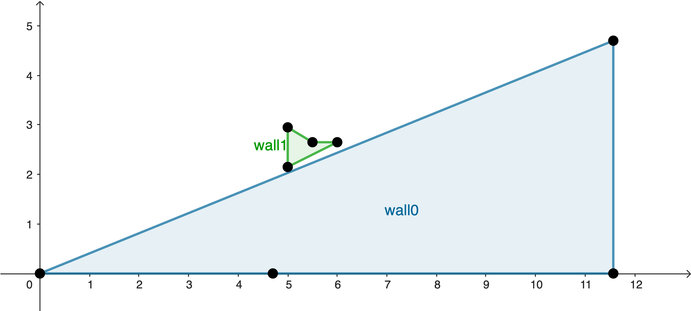

# Tutorial for the ```CrowdMechanics``` engine

The purpose of the engine is to take a configuration of agents, who may or may not have obstacles around, and evolve their position given driving forces and torques, duly handling possible collisions.

There is a single standalone function to be called, that will take as input a list of XML files names and will produce XML files with the resulting configuration.

There are two types of files: the static ones which contains immutable parameters such as the positions of walls, the characteristics of the materials, ... And the dynamic ones that contain values that change over time, ie the kinematics and dynamics of the agents:

- **Static**:
  - *Parameters* contain technical information such as working directories, but also time intervals of the simulation;
  - *Materials* contain physical information about the materials the agents and obstacles are made of;
  - *Geometry* details the layout of the scene: dimensions and positions of obstacles
  - *Agents* lists the agents and the shapes that constitute them.
- **Dynamic**
  - *Agent Dynamics* contain the current positions and velocities of the agents, as well as the driving forces and torques we apply to them. It is used as input as well as as output of the library.
  - (*optional*) *Agent Interactions* is a product of the library that lists all the contacts, be it agent/agent or agent/obstacle, the forces on each agent as well as a technical quantity that we call the Tangential relative displacement. This file must also be provided as input to the library if the current execution is part of a series of consecutive executions of the same situation.

We detail the contents of those files below, by order of importance and of input into the function.

> Note: we use the external library [tinyxml2](http://leethomason.github.io/tinyxml2/index.html) for the handling of XML files.

## Static information

### Parameters
The layout is the following:
```xml
<?xml version="1.0" encoding="utf-8"?>
<Parameters>
    <Directories Static="/AbsolutePathToStatic/" Dynamic="/AbsolutePathToDynamic/"/>
    <Times TimeStep="0.1" TimeStepMechanical="1e-5"/>
</Parameters>
```
First, note that the Parameters are enclosed in a root *Parameters* tag. This will be the same for each of the XML files.
The expected tags/fields are
- (*mandatory*) ```<Parameters>``` end its enclosing tag ```</Parameters>``` surround all other data.
- (*mandatory*) ```<Directories>```
  - ```Static``` (type ```std::string```) is the absolute path to the directory where the library can find the **static** XML files.
  - ```Dynamic``` (type ```std::string```) is the absolute path to the directory where the library can find the **dynamic** XML files.
- (*mandatory*) ```<Times>```
  - ```TimeStep``` (type ```double```) is the total time of the simulation.
  - ```TimeStepMechanical``` (type ```double```) is the (smaller) time interval of the calculation of mechanical contacts.

Note that when calling the library, an absolute path to the Parameters file should be given, whereas the other string should just contain the file names since the directories in which they have been put are given by the Parameters file.

### Materials
```xml
<?xml version="1.0" encoding="utf-8"?>
<Materials>
    <Intrinsic>
        <Material Id="concrete" YoungModulus="1.70e+10" ShearModulus="7.10e+09"/>
        <Material Id="human_clothes" YoungModulus="3.05e+06" ShearModulus="1.02e+06"/>
        <Material Id="human_naked" YoungModulus="2.60e+06" ShearModulus="7.50e+05"/>
    </Intrinsic>
    <Binary>
        <Contact Id1="concrete" Id2="concrete" GammaNormal="1.30e+04" GammaTangential="1.30e+04" KineticFriction="0.50"/>
        <Contact Id1="concrete" Id2="human_clothes" GammaNormal="1.30e+04" GammaTangential="1.30e+04" KineticFriction="0.50"/>
        <Contact Id1="concrete" Id2="human_naked" GammaNormal="1.30e+04" GammaTangential="1.30e+04" KineticFriction="0.50"/>
        <Contact Id1="human_clothes" Id2="human_clothes" GammaNormal="1.30e+04" GammaTangential="1.30e+04" KineticFriction="0.50"/>
        <Contact Id1="human_clothes" Id2="human_naked" GammaNormal="1.30e+04" GammaTangential="1.30e+04" KineticFriction="0.50"/>
        <Contact Id1="human_naked" Id2="human_naked" GammaNormal="1.30e+04" GammaTangential="1.30e+04" KineticFriction="0.50"/>
    </Binary>
</Materials>
```
- (*mandatory*) ```<Materials>``` and its closing tag ```</Materials>``` enclose all data.
- (*mandatory*) ```<Intrinsic>``` and its closing tag ```</Intrinsic>``` enclose the intrinsic properties of the materials:
  - (*mandatory*) One ```<Material>``` tag per material, with the fields
    - (*mandatory*, *unique*) ```Id``` (type ```std::string```) is an identifier for the material;
    - (*optional*) ```Name``` is not used byt the library;
    - (*mandatory*) ```YoungModulus``` (type ```double```) is the value of Young's modulus {math}`E`;
    - (*mandatory*) ```ShearModulus``` (type ```double```) is the value of the shear modulus {math}`G`.
- (*mandatory*) ```<Binary>``` and its closing tag ```</Binary>``` enclose the binary properties of the materials, ie the physical quantities related to the contact of two materials:
  - (*mandatory*) One ```<Contact>``` tag per couple. <span style="color: red">All couples should be given</span>. The following fields are expected:
    - (*mandatory*) ```Id1``` and ```Id2``` (type ```std::string```) is and identifier for the material;
    - (*mandatory*) ```GammaNormal``` is the value of the normal damping factor {math}`\Gamma_{\rm n}` ;
    - (*mandatory*) ```GammaTangential``` is the value of the tangential damping factor {math}`\Gamma_{\rm t}` ;
    - (*mandatory*) ```KineticFriction``` is the value of the kinetic friction coefficient {math}`\mu_{\rm dyn}`.

### Geometry
The Geometry file gives the dimensions of the area in which the simulation takes place, as well as information about obstacles.
The latter as given as **Walls**, which are an ordered list of **Corners**. Each **Corner** is linked to its direct together by a line segment, forming a wall face. Here below an example:
<tr>
  <td align="center" style="width:100%;">
    
  </td>
</tr>

```xml
<?xml version="1.0" encoding="utf-8"?>
<Geometry>
    <Dimensions Lx="11.57" Ly="4.7"/>
    <Wall Id="0" MaterialId="concrete">
        <Corner Coordinates="0.0,0.0"/>
        <Corner Coordinates="0.0,4.7"/>
        <Corner Coordinates="11.57,4.7"/>
        <Corner Coordinates="11.57,0.0"/>
        <Corner Coordinates="0.0,0.0"/>
    </Wall>
    <Wall Id="1" MaterialId="concrete">
        <Corner Coordinates="5.0,2.15"/>
        <Corner Coordinates="6.0,2.65"/>
        <Corner Coordinates="5.0,2.95"/>
        <Corner Coordinates="5.5,2.65"/>
        <Corner Coordinates="5.0,2.15"/>
    </Wall>
</Geometry>
```
- (*mandatory*) ```<Geometry>``` and its closing tag ```</Geometry>``` enclose all data.
  - (*mandatory*) ```<Dimensions>``` contain the dimensions of the rectangular domain:
    - (*mandatory*) ```Lx``` (type ```double```) is the length of the domain along the x-axis;
    - (*mandatory*) ```Ly``` (type ```double```) is the length of the domain along the y-axis.
  - (*mandatory*) One ```<Wall>``` tag per wall, with the field
    - (*optional*) ```MaterialId``` (type ```std::string```) related to the Ids in the [Materials file](#Materials). If not given or not found, the default value for walls is used.
    - (*mandatory*) ```Corner``` tags: at least two of them must be present. Each one contains the *mandatory* field ```Coordinates``` (type ```std::pair<double>```).
  - (*mandatory*) A closing ```</Wall>``` tag after the list of corners.

Note that in the example, the first wall is actually enclosing the whole domain and thus acts as a strict boundary.

### Agents
```xml
<?xml version="1.0" encoding="utf-8"?>
<Agents>
    <Agent Type="pedestrian" Id="0" Mass="90.72" Height="1.83" MomentOfInertia="2.05" FloorDamping="2.00" AngularDamping="2.00">
        <Shape Type="disk" Radius="0.098" MaterialId="human_naked" Position="-0.017,0.164"/>
        <Shape Type="disk" Radius="0.134" MaterialId="human_naked" Position="0.010,0.072"/>
        <Shape Type="disk" Radius="0.141" MaterialId="human_naked" Position="0.015,0.000"/>
        <Shape Type="disk" Radius="0.134" MaterialId="human_naked" Position="0.010,-0.072"/>
        <Shape Type="disk" Radius="0.098" MaterialId="human_naked" Position="-0.017,-0.164"/>
    </Agent>
    <Agent Type="pedestrian" Id="1" Mass="68.04" Height="1.75" MomentOfInertia="1.18" FloorDamping="2.00" AngularDamping="2.00">
        <Shape Type="disk" Radius="0.069" MaterialId="human_naked" Position="-0.017,0.167"/>
        <Shape Type="disk" Radius="0.095" MaterialId="human_naked" Position="0.010,0.073"/>
        <Shape Type="disk" Radius="0.100" MaterialId="human_naked" Position="0.015,0.000"/>
        <Shape Type="disk" Radius="0.095" MaterialId="human_naked" Position="0.010,-0.073"/>
        <Shape Type="disk" Radius="0.069" MaterialId="human_naked" Position="-0.017,-0.167"/>
    </Agent>
    <Agent Type="pedestrian" Id="2" Mass="74.39" Height="1.80" MomentOfInertia="1.39" FloorDamping="2.00" AngularDamping="2.00">
        <Shape Type="disk" Radius="0.084" MaterialId="human_naked" Position="-0.017,0.156"/>
        <Shape Type="disk" Radius="0.116" MaterialId="human_naked" Position="0.010,0.069"/>
        <Shape Type="disk" Radius="0.121" MaterialId="human_naked" Position="0.015,0.000"/>
        <Shape Type="disk" Radius="0.116" MaterialId="human_naked" Position="0.010,-0.069"/>
        <Shape Type="disk" Radius="0.084" MaterialId="human_naked" Position="-0.017,-0.156"/>
    </Agent>
    <Agent Type="pedestrian" Id="3" Mass="115.67" Height="1.83" MomentOfInertia="2.97" FloorDamping="2.00" AngularDamping="2.00">
        <Shape Type="disk" Radius="0.102" MaterialId="human_naked" Position="-0.017,0.180"/>
        <Shape Type="disk" Radius="0.140" MaterialId="human_naked" Position="0.010,0.079"/>
        <Shape Type="disk" Radius="0.146" MaterialId="human_naked" Position="0.015,0.000"/>
        <Shape Type="disk" Radius="0.140" MaterialId="human_naked" Position="0.010,-0.079"/>
        <Shape Type="disk" Radius="0.102" MaterialId="human_naked" Position="-0.017,-0.180"/>
    </Agent>
    <Agent Type="pedestrian" Id="4" Mass="91.17" Height="1.83" MomentOfInertia="1.89" FloorDamping="2.00" AngularDamping="2.00">
        <Shape Type="disk" Radius="0.088" MaterialId="human_naked" Position="-0.017,0.165"/>
        <Shape Type="disk" Radius="0.122" MaterialId="human_naked" Position="0.010,0.073"/>
        <Shape Type="disk" Radius="0.127" MaterialId="human_naked" Position="0.015,-0.000"/>
        <Shape Type="disk" Radius="0.122" MaterialId="human_naked" Position="0.010,-0.073"/>
        <Shape Type="disk" Radius="0.088" MaterialId="human_naked" Position="-0.017,-0.165"/>
    </Agent>
    <Agent Type="pedestrian" Id="5" Mass="87.54" Height="1.90" MomentOfInertia="1.90" FloorDamping="2.00" AngularDamping="2.00">
        <Shape Type="disk" Radius="0.088" MaterialId="human_naked" Position="-0.017,0.173"/>
        <Shape Type="disk" Radius="0.122" MaterialId="human_naked" Position="0.010,0.076"/>
        <Shape Type="disk" Radius="0.127" MaterialId="human_naked" Position="0.015,-0.000"/>
        <Shape Type="disk" Radius="0.122" MaterialId="human_naked" Position="0.010,-0.076"/>
        <Shape Type="disk" Radius="0.088" MaterialId="human_naked" Position="-0.017,-0.173"/>
    </Agent>
    <Agent Type="pedestrian" Id="6" Mass="95.25" Height="1.73" MomentOfInertia="2.33" FloorDamping="2.00" AngularDamping="2.00">
        <Shape Type="disk" Radius="0.104" MaterialId="human_naked" Position="-0.017,0.168"/>
        <Shape Type="disk" Radius="0.143" MaterialId="human_naked" Position="0.010,0.074"/>
        <Shape Type="disk" Radius="0.149" MaterialId="human_naked" Position="0.015,0.000"/>
        <Shape Type="disk" Radius="0.143" MaterialId="human_naked" Position="0.010,-0.074"/>
        <Shape Type="disk" Radius="0.104" MaterialId="human_naked" Position="-0.017,-0.168"/>
    </Agent>
    <Agent Type="pedestrian" Id="7" Mass="98.88" Height="1.68" MomentOfInertia="2.41" FloorDamping="2.00" AngularDamping="2.00">
        <Shape Type="disk" Radius="0.104" MaterialId="human_naked" Position="-0.017,0.168"/>
        <Shape Type="disk" Radius="0.143" MaterialId="human_naked" Position="0.010,0.074"/>
        <Shape Type="disk" Radius="0.149" MaterialId="human_naked" Position="0.015,0.000"/>
        <Shape Type="disk" Radius="0.143" MaterialId="human_naked" Position="0.010,-0.074"/>
        <Shape Type="disk" Radius="0.104" MaterialId="human_naked" Position="-0.017,-0.168"/>
    </Agent>
</Agents>
```

- (*mandatory*) ```<Agents>``` and its closing tag ```</Agents>``` enclose all data.
  - (*mandatory*) ```<Agent>``` and its closing tag ```</Agent>``` enclose each agent. It contains the following fields:
    - (*optional*, *unused*) ```Type``` is unused for now since the current version only handles pedestrians, but we mention it since we are working on adapting the model to other active modes.
    - (*mandatory*, *unique*) ```Id``` (type ```std::string```) is a unique Id for the agent;
    - (*mandatory*) ```Mass``` (type ```double```) is the mass (in {math}`\rm kg`) of the agent;
    - (*mandatory*) ```MomentOfInertia``` (type ```double```) is the moment of inertia (in {math}`\rm kg\,m^2`) of the agent, with respect to a vertical axis going through the center of mass of the agent;
    - (*optional*) ```FloorDamping``` is the inverse of the quantity {math}`\tau_{\rm mech}` (in {math}`\rm s^{-1}`) found in the equations of motion of an unhindered agent. If not given, the default value is used;
    - (*optional*) ```AngularDamping``` is the angular version (ie related to angular movement) of the above. If not given, the default value is used;
  - (*mandatory*) Each ```<Agent>``` encloses exactly **five** ```<Shape>``` tags, which <span style="color:red">should be given in a specific order</span>, ie from the left shoulder to the right shoulder. They consisting in the following fields:
    - (*mandatory*, *unique within a specific agent*) ```Id``` (type ```std::string```) is an identifier for the shape.
    - (*optional*, *unused*) ```Type``` is unused for now since the current version only handles disks, but we mention it since we are working on adapting the model to other active modes.
    - (*mandatory*) ```Radius``` (type ```double```) is the radius of the disk;
    - (*optional*) ```MaterialId``` (type ```std::string```) related to the Ids in the [Materials file](#Materials). If not given or not found, the default value for humans is used.
    - (*mandatory*) ```Position``` (type ```std::pair<double>```) is the position of the center of mass of the shape, <span style="color: red">relative to the center of mass of the agent</span>.

## Dynamic information
### Agent Dynamics
#### As input
```xml
<?xml version="1.0" encoding="utf-8"?>
<Agents>
    <Agent Id="0">
        <Kinematics Position="1.115,0.362" Velocity="0.00,0.00" Theta="-0.29" Omega="0.00"/>
        <Dynamics Fp="100.0,0.0" Mp="0.00"/>
    </Agent>
    <Agent Id="1">
        <Kinematics Position="0.211,0.235" Velocity="0.00,0.00" Theta="-0.48" Omega="0.00"/>
        <Dynamics Fp="100.0,0.00" Mp="0.00"/>
    </Agent>
    <Agent Id="2">
        <Kinematics Position="0.239,0.920" Velocity="0.00,0.00" Theta="-0.16" Omega="0.00"/>
        <Dynamics Fp="100.0,0.00" Mp="0.00"/>
    </Agent>
    <Agent Id="3">
        <Kinematics Position="0.724,0.929" Velocity="0.00,0.00" Theta="0.35" Omega="0.00"/>
        <Dynamics Fp="100.0,0.0" Mp="0.00"/>
    </Agent>
    <Agent Id="4">
        <Kinematics Position="0.463,0.252" Velocity="0.00,0.00" Theta="-0.21" Omega="0.00"/>
        <Dynamics Fp="100.0,0.0" Mp="0.00"/>
    </Agent>
    <Agent Id="5">
        <Kinematics Position="0.437,0.709" Velocity="0.00,0.00" Theta="-0.36" Omega="0.00"/>
        <Dynamics Fp="100.0,0.0" Mp="0.00"/>
    </Agent>
    <Agent Id="6">
        <Kinematics Position="0.757,0.299" Velocity="0.00,0.00" Theta="-0.20" Omega="0.00"/>
        <Dynamics Fp="100.0,0.0" Mp="0.00"/>
    </Agent>
    <Agent Id="7">
        <Kinematics Position="1.039,0.875" Velocity="0.00,0.00" Theta="-0.07" Omega="0.00"/>
        <Dynamics Fp="100.0,0.0" Mp="0.00"/>
    </Agent>
</Agents>
```
- (*mandatory*) ```<Agents>``` and its closing tag ```</Agents>``` enclose all data.
  - (*mandatory*) ```<Agent>``` and its closing tag ```</Agent>``` enclose each agent. It contains the ```Id``` of the agent, which should be in the [Agents file](#agents):
    - (*mandatory*) The ```<Kinematics>``` tag is the current state of the agent, and contains the following fields:
      - (*mandatory*) ```Position``` (type ```std::pair<double>```) is the position of the center of mass of the agent;
      - (*mandatory*) ```Velocity``` (type ```std::pair<double>```) is the velocity of the center of mass of the agent;
      - (*mandatory*) ```Theta``` (type ```double```) is the angle between the direction of the body, ie the line of sight when looking straight, and the x-axis.
      - (*mandatory*) ```Omega``` (type ```double```) is the angular speed of the body.
    - (*mandatory*) The ```<Dynamics>``` tag is the driving forces given to the agent, and contains the following fields:
      - (*mandatory*) ```Fp``` (type ```std::pair<double>```) is the driving force;
      - (*mandatory*) ```Mp``` (type ```double```) is the driving torque;

> Note: All angular quantities are given with the right-handed convention, ie a positive value is to be taken counterclockwise.
>
> Note2: The driving force and torque are related to the equations of motion of the unhindered agent, ie
```{math}
\frac{{\rm d}{\bf v}}{{\rm d}t}=\frac{{\bf v}^{\rm des}-{\bf v}}{\tau_{\rm mech}}\;,
```
> by {math}`{\bf F}_{\rm p}=m\frac{{\bf v}^{\rm des}}{\tau_{\rm mech}}.` Same goes for the angular version.

#### As output
The output of ```CrowdMechanics``` will have the same structure, except that the ```Dynamics``` tag will no longer be present. The ```Kinematics``` tag will contain the new state of the agent, after a time ```TimeStep```, eg:
```xml
<?xml version="1.0" encoding="utf-8"?>
<Agents>
    <Agent Id="0">
        <Kinematics Position="1.12016,0.362" Velocity="0.0999059,0" Theta="-0.29" Omega="0"/>
    </Agent>
    <Agent Id="1">
        <Kinematics Position="0.217882,0.235" Velocity="0.133208,0" Theta="-0.48" Omega="0"/>
    </Agent>
    <Agent Id="2">
        <Kinematics Position="0.245295,0.92" Velocity="0.121837,0" Theta="-0.16" Omega="0"/>
    </Agent>
    <Agent Id="3">
        <Kinematics Position="0.728048,0.929" Velocity="0.0783562,0" Theta="0.35" Omega="0"/>
    </Agent>
    <Agent Id="4">
        <Kinematics Position="0.468136,0.252" Velocity="0.0994128,0" Theta="-0.21" Omega="0"/>
    </Agent>
    <Agent Id="5">
        <Kinematics Position="0.442349,0.709" Velocity="0.103535,0" Theta="-0.36" Omega="0"/>
    </Agent>
    <Agent Id="6">
        <Kinematics Position="0.761916,0.299" Velocity="0.0951545,0" Theta="-0.2" Omega="0"/>
    </Agent>
    <Agent Id="7">
        <Kinematics Position="1.04374,0.875" Velocity="0.0916612,0" Theta="-0.07" Omega="0"/>
    </Agent>
</Agents>
```

### Agent Interactions
The library outputs information about collisions between agents, and between agents and walls. This serves two purposes:
- The total normal force on the agents allows computation of the pressure exerted on them;
- If the current execution of the library is a part of a series of consecutive runs in time, this file should remain as is since it will be used by the next execution to gather technical information about current existing contacts.

Since this file should not be "prepared" by the user, it will always have the same name ```AgentInteractions.xml``` and will always be stored in the current working directory.

```xml
<?xml version="1.0" encoding="utf-8"?>
<Interactions>
    <Agent Id="1">
        <Agent Id="4">
            <Interaction ParentShape="0" ChildShape="4" TangentialRelativeDisplacement="0.0702898,0.116009" Fn="24.0482,-24.2272" Ft="-12.1136,-12.0241" />
        </Agent>
    </Agent>
    <Agent Id="2">
        <Agent Id="5">
            <Interaction ParentShape="0" ChildShape="4" TangentialRelativeDisplacement="-0.00856562,-0.00110708" Fn="1.87401,-15.7522" Ft="7.87609,0.937003" />
        </Agent>
        <Agent Id="3">
            <Interaction ParentShape="4" ChildShape="0" TangentialRelativeDisplacement="-0.014449,-0.00107084" Fn="-1.03866,10.9581" Ft="-5.47907,-0.519329" />
        </Agent>
        <Wall ShapeId="2" WallId="0" CornerId="1" TangentialRelativeDisplacement="5.56437e-20,0.00187981" Ft="-5.87726e-15,-10.4114" Fn="-20.8227,1.15847e-14" />
    </Agent>
    <Agent Id="3">
        <Wall ShapeId="2" WallId="0" CornerId="1" TangentialRelativeDisplacement="2.21771e-20,0.000800011" Ft="-0,-20.4459" Fn="-40.8918,0" />
    </Agent>
    <Agent Id="4">
        <Wall ShapeId="3" WallId="0" CornerId="0" TangentialRelativeDisplacement="0.00114503,2.68642e-19" Ft="-17.0155,-2.49639e-14" Fn="4.92101e-14,-34.031" />
        <Wall ShapeId="4" WallId="0" CornerId="0" TangentialRelativeDisplacement="0.0234234,5.68356e-19" Ft="-285.367,-0" Fn="2.01765e-13,-570.733" />
    </Agent>
    <Agent Id="5">
        <Wall ShapeId="0" WallId="0" CornerId="2" TangentialRelativeDisplacement="0.0478101,-4.8409e-19" Ft="-17.6357,-0" Fn="0,-35.2714" />
    </Agent>
    <Agent Id="6">
        <Wall ShapeId="0" WallId="0" CornerId="2" TangentialRelativeDisplacement="0.00153013,-4.37696e-20" Ft="-10.2514,4.56527e-15" Fn="-9.14726e-15,-20.5028" />
    </Agent>
</Interactions>
```
> **<span style="color: red">Important note</span>** The files give only one of the reciprocal interactions between two agents: it will only give the couples {math}`i,j` with {math}`i < j`.

- (*mandatory*) ```<Interactions>``` and its closing tag ```</Interactions>``` enclose all data.
  - (*mandatory*) ```<Agent>``` and its closing tag ```</Agent>``` enclose each agent. It contains the ```Id``` of the agent, which should be in the [Agents file](#agents). It corresponds to the index {math}`i` in the note above and will be name the "Parent".
    - (*optional*) ```<Agent>``` and its closing tag ```</Agent>``` enclose each "Child" agent. It contains the ```Id``` of the agent, which should be in the [Agents file](#agents), and corresponds to the index {math}`j` above.
      - (*mandatory*) For each couple, we can have several ```<Interaction>``` tags, as multiple shapes could touch each other. The tag contains the following:
        - (*mandatory*) ```ParentShape``` refers to the ```Id``` of the shape of the Parent that is in touch with the Child, and that comes from the [Agents file](#agents);
        - (*mandatory*) ```ChildShape``` refers to the ```Id``` of the shape of the Child that is in touch with ```ParentShape```, and that comes from the [Agents file](#agents);
        - (*mandatory*) ```TangentialRelativeDisplacement``` (type ```std::pair<double>```) is a technical field used by the library to know if there is a contact, that represents the relative displacement that has occurred during the contact;
        - (*mandatory*) ```Fn``` (type ```std::pair<double>```) is the normal force exerted on the ```ParentShape```, as a result of its contact with ```ChildShape```;
        - (*mandatory*) ```Ft``` (type ```std::pair<double>```) is the tangential force exerted on the ```ParentShape```, as a result of its contact with ```ChildShape```.
    - (*optional*) There will be a ```<Wall>``` tag for each contact between the Parent and a wall face:
      - (*mandatory*) ```ShapeId``` is the Id of the shape of the Parent that is in contact with a wall;
      - (*mandatory*) ```WallId``` (type ```unsigned```) is a number attributed to the ```<Wall>``` tags coming from the [Geometry file](#geometry);
      - (*mandatory*) ```CornerId``` (type ```unsigned```) is a number attributed to the ```<Corner>``` tags coming from the [Geometry file](#geometry). In this context, it represents the wall face joining corner ```CornerId``` to corner ```CornerId + 1``` ;
      - (*mandatory*) The same 3 fields as for the agent/agent interactions complete the ```<Wall>``` tag.
